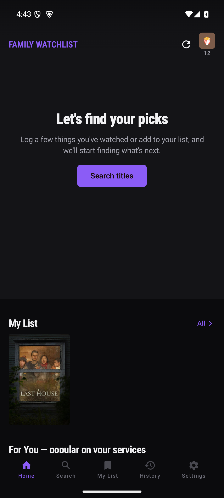
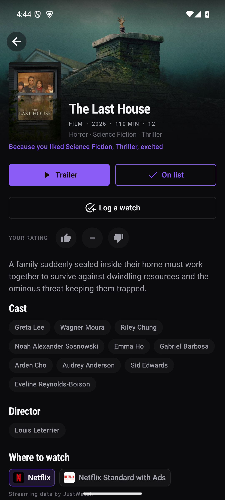
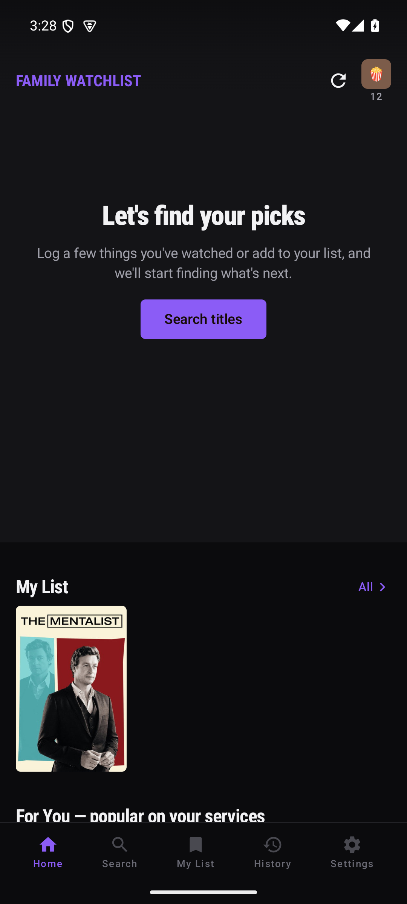
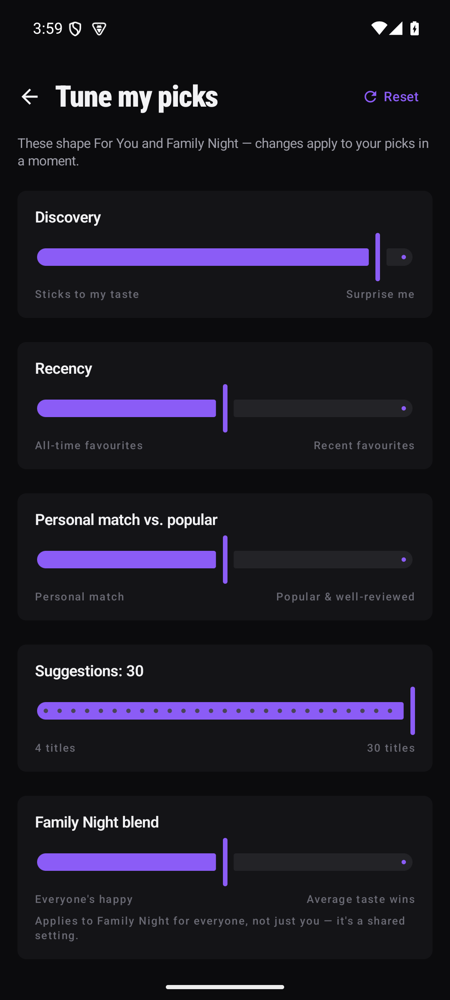
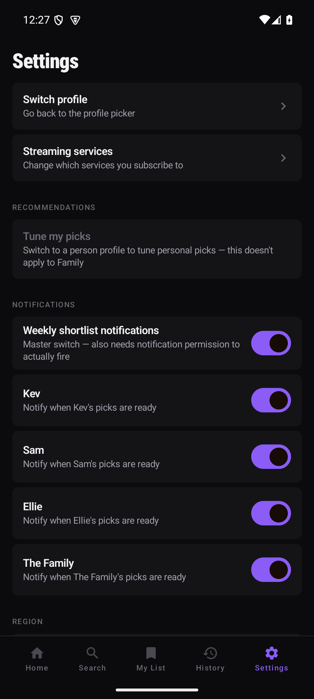

# Family Watchlist

A private, single-household Android app that tracks what the family has actually watched,
learns everyone's taste locally on the device, and recommends what to watch next — restricted
to titles genuinely available on the UK streaming services you already pay for.

No accounts, no cloud sync, no ads. Everything lives in a local Room database; the only network
calls are to [TMDB](https://www.themoviedb.org/) for metadata/availability and to fetch a
trailer. Recommendations are a deterministic, hand-written scoring function — not a trained
model, nothing about your household ever leaves the device or trains anything.

## Why

Streaming-service "watch next" algorithms only know what you did on *that* service. This app
knows what everyone in the household watched, on any service, and folds in explicit thumbs
ratings, per-profile taste sliders, and each person's age-rating cap — then only ever suggests
things you can actually press play on tonight.

## Features

- **Multiple profiles**, up to 10, each with an avatar, an optional UK age-rating cap, and its
  own taste sliders (discovery vs. safe bets, recency, personal match vs. popularity).
- **A "Family" profile** — a curated, persistent group (e.g. "everyone downstairs on a Friday")
  with its own independently-scored shortlist, distinct from the ad-hoc "who's watching tonight"
  chip picker.
- **One shared "My List"**, tagged with who added each title, filterable to "everyone" or "just
  me"; items outside your subscribed services or your age cap render dimmed rather than
  disappearing.
- **Logging watches**, not just adding to a list — one event, multiple profiles tagged at once
  (family night = one row), thumbs up/neutral/down per person, editable history.
- **Recommendations** blend recency, personal taste, discovery, and TMDB popularity/quality —
  fully explained with a "Because you liked …" reason line — refreshed on a configurable weekly
  schedule, with an optional notification when a profile's picks are ready.
- **Search restricted to what you can watch** — results are filtered to titles currently
  streaming on a subscribed GB service, not a general TMDB catalog browser.
- **JSON backup/restore** of everything above via Android's Storage Access Framework — you pick
  the file location, nothing needs a broad storage permission. The TMDB metadata/availability
  cache is deliberately excluded (it's just TMDB's own data, refetched automatically); see
  Settings → Backup & restore.
- Dark-first, Material 3 dynamic colour, edge-to-edge streamer-style UI — poster carousels,
  provider badges, trailer playback, predictive back.

## Screenshots

| Home | Title details | My List (Family) |
|---|---|---|
|  |  |  |

| Tune my picks | Settings |
|---|---|
|  |  |

More screenshots from each milestone's live-verification pass are under [`docs/`](docs/).

## Building & previewing

Standard Android Studio / Gradle project — Kotlin + Jetpack Compose, Room, Retrofit, manual DI
(`AppContainer`), no Hilt. You'll need a TMDB v4 read access token in `local.properties`
(`TMDB_ACCESS_TOKEN=...`, git-ignored, never committed).

```bash
./gradlew test assembleDebug
```

For running against an emulator or a real phone from a headless dev box — boot commands, scrcpy
mirroring, wireless ADB — see [`docs/PREVIEW.md`](docs/PREVIEW.md).

The full spec (data model, TMDB integration, recommender design, screen-by-screen UX, milestone
plan) lives in [`PLAN.md`](PLAN.md); [`PROGRESS.md`](PROGRESS.md) tracks what's actually shipped
against it.

## Attribution

This application uses TMDB and the TMDB APIs but is not endorsed, certified, or otherwise
approved by TMDB.

Streaming data by JustWatch

Both notices appear on first launch and in Settings → About, alongside the TMDB logo, as
required by TMDB's API terms.
